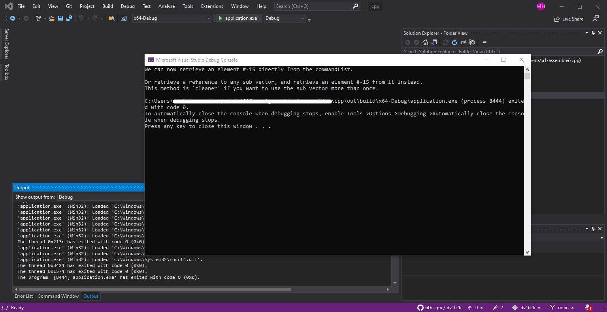

# Uppgiftsbeskrivning för laboration 1 - Assembler

## Snabblänkar till mallar och inlämningssidor

- **Kodmall:** <länk>
- **Deadline 1:** <länk>
- **Deadline 2:** <länk>
- **Deadline 3:** <länk>

## Innehåll

- [Syfte](#Syfte)
- [Uppgift](#Uppgift)
- [Kriterier](#Kriterier)
- [Komma igång](#Komma-igång)
- [Automatiska tester](#Automatiska-tester)
- [Grundläggande assembly (för denna uppgift)](#Grundläggande-assembly-(för-denna-uppgift))

# Syfte

Denna uppgift kommer att examinera dig på:

- Operatorer och datatyper i C++
- Program med flera kodfiler och deklarationsfiler
- In- och utmatning från/till strömmar (cin, cout) och filer

```
Detta är en individuell examination. All kod du lämnar in ska vara skriven av dig och enbart dig, med undantag för den kod som följer med i uppgiftsmallen. Det kommer att utföras en plagieringskontroll på inlämnad kod. Var noga att inte dela din egen kod med andra personer då båda era inlämningar kommer flaggas som plagiat.
```

# Uppgift

Kursens första uppgift handlar om övergången från Python till C++. I denna uppgift får du ett Python-program som du ska översätta till C++, där din kodstruktur ska vara *så lik som möjligt* till orginalkoden med undantag där de två språken beter sig olika.

Programmet som du ska översätta är en simplfierad assemblyinterpretator. Med korta ord innebär detta att du kommer skapa ett program som exekverar ett annat program. Assembly vad man kallar ett *lågnivåspråk* och är så nära vi programmerare kommer till hårdvaran utan att behöva skriva maskinkod med 1or och 0or. Följande är ett exempelprogram som ditt program ska interpretera:
```asm
JGT R1 R0 #4

SUB R0 R0 R1
JGT R0 R1 #-1
JEQ R0 R1 #-2

MOV R1 #0
```
Exempelkoden ovan utför en modulusoperation mellan två tal. Det är helt naturligt att inte förstå assembly för denna uppgift, så vi kommer enbart att gå igenom det mest grundläggande för att kunna tolka koden ovan. **Notera att du inte kommer behöva programmera assembly i denna uppgift; ditt program kommer endast att behöva läsa assembly-filer som du får i uppgiften.** Om du är intresserad får du självklart försöka skriva ett eget program i assembly när din interpreterare fungerar.

För att testa Python-programmet, ladda ner kodmallen nedan och packa upp till en önskad mapp. Öppna den uppackade mappen och navigera till mappen `python`. Här kan du nu hitta ett Python-program `main.py`. Följande bild demonstrerar en exempelkörning av Python-programmet:


- `mul.asm` är ett assembly-program som utför multiplikation för två tal
- `mod.asm` är ett assembly-program som utför moduloräkning för två tal
- Notera att det alltid skrivs ut åtta (8) tal; dessa är *register*. Läs mer om detta längre ner under sektionen [Grundläggande assembly (för denna uppgift)](#Grundläggande-assembly-(för-denna-uppgift))

Du ska nu översätta detta Python-program till C++. Din C++-kod förväntas vara så lika som Python-koden som språken tillåter. Målet är att du ska inse likheter och olikheter mellan språken.

# Kriterier

För betyget G ska följande kriterier vara uppfyllda:
1. `application` ska kompilera på CodeGrade
    - `application` är en exekverbar fil som byggs av filerna `main.cpp` och `assembler.cpp`
2. `auto-tests` ska kompilera på CodeGrade
    - `auto-tests` är en exekverbar fil som byggs av filerna `test/test-main.cpp` och `assembler.cpp`
3. Den kod du lämnar in förväntas följa samma logik som det tillhandahållna Python-programmet.
4. Ditt program ska kunna exekvera de två tillhandahållna assmembly-filerna `mul.asm` och `mod.asm` och skriva ut korrekta värden.

Att tänka på:
- Det är ok att arbeta med extra debug-utskrifter när du arbetar, men kom ihåg att ta bort dessa innan du lämnar in. Om ditt program skriver ut mer information i terminalen än det tillhandahållna Python-programet följer de inte samma logik.

# Komma igång

**Ladda ner och packa upp följande kodmall:** <länk>

Mallen innehåller följande mappar och filer:

- `cpp/`
    - `test/`
    - `assembler.cpp` <- Denna ska du modifiera
    - `assembler.hpp`
    - `CMakeLists.txt`
    - `CMakeSettings.json`
    - `main.cpp` <- Denna ska du modifiera
    - `mod.asm`
    - `mul.asm`
- `python/`
    - `assembler.py`
    - `main.py`
    - `mod.asm`
    - `mul.asm`

Alla filer med `CMake` i namnet är enbart för att alla, oavsett platform, ska kunna kompilera och köra projektet utan att behöva sätta upp nya projekt. För mer information, se sidan *Komma igång med CMake* i Canvas.

De enda filer som du ska modifiera är `cpp/assembler.cpp` och `cpp/main.cpp` baserat på deras motsvarande filer `python/assembler.py` respektive `python/main.py` från orginalprogrammet. Notera att headerfilen `cpp/assembler.hpp` **INTE** ska modifieras, då denna redan innehåller alla funktionsdeklarationer som ska vara *publika* mellan `.cpp`-filerna. Alla dessa funktioner måste dock definieras `cpp/assembler.cpp` innan de kan användas i `cpp/main.cpp`, och det är ok att skapa egna *privata* hjälpfunktioner i `cpp/assembler.cpp` om så behövs/önskas.

## Bygga med Visual Studio 2019

1. Välj *open a local folder* från startsidan, eller *File->Open->Folder...*
2. Navigera till och välj den uppackade mappen
    - **Obs!** Öppna alltid i mappen där `CMakeLists.txt` finns!
    - Efter du valt mappen kommer du se i fönstret *Output* att CMake initierar projektet
3. Öppna dropdown vid knappen med grön pil, välj *target* `application.exe`
    - Om du senare vill kompilera automatiska tester, välj istället *target* `auto-tests`
    - **Obs!** Det kommer ej gå att kompilera tester innan du har definierat alla funktioner i `assembler.cpp` som har deklarerats i `assembler.hpp`

    

4. Tryck på knappen `application.exe` med grön pil för att starta programmet

    

## Bygga med VS Code

1. Välj *File->Open Folder...*
2. Navigera till och välj den uppackade mappen
    - **Obs!** Öppna alltid i mappen där `CMakeLists.txt` finns!
3. Tryck `ctrl`+`shift`+`p` och välj *CMake: Configure* (du kan behöva söka "CMake" för att se detta)
    - Du kommer att se att CMake initierar CMake i fönstret *Output*
    - Om du blir frågad att välja *Kit for cpp* eller *compiler*, välj
        - GCC om du sitter i Linux/WSL (gdb för debug)
        - Clang om du sitter i MacOS
    - Om du inte har något av dessa val, se sidan *Komma igång med CMake* i Canvas 
    
    

4. Tryck på knappen `[all]` i panelen längst ner i VS Code, välj *target* `application`
    - Om du senare vill kompilera automatiska tester, välj istället *target* `auto-tests`
    - **Obs!** Det kommer ej gå att kompilera tester innan du har definierat alla funktioner i `assembler.cpp` som har deklarerats i `assembler.hpp`

    

5. För att exekvera programmet, tryck på pilen i panelen längst ner
    - **Obs!** Kom ihåg att välja rätt *build target* och *run target* beroende på om du vill bygga/köra applikationen eller tester.

    

# Automatiska tester

Vid inlämning kommer ditt program kontrolleras med s.k. *enhetstester*. Dessa tester är i sig ett eget program som kommer testa så att dina fungerar korrekt. Ett test kan exempelvis testa att en funktion returnerar rätt värde när ett specifik värde ges som argument, eller att funktionen hanterar en felsituation korrekt när ett felaktigt värde ges som argument istället.

Dessa tester följer även med i kodmallen ovan, så du har möjlighet att provköra testerna innan du skickar in din uppgift. För att köra de testerna, kompilera och kör *target* `auto-tests` istället för `applicaiton`. Om ett eller flera tester inte passerar kommer de skriva ut information om vad som testats och vad som förväntas:


**Obs!** Notera att de automatiska testerna endast kompilerar filerna `test/test-main.cpp` och `assembler.cpp`, inte `main.cpp`. Testerna kommer alltså bara att testa de funktioner som redan har deklarerats i `assembler.hpp`, och kommeer **inte** att kontrollera utkrifter från ditt program när du kör utan tester med `application`. När du lämnar in uppgiften kommer CodeGrade utföra egna tester för att kontrollera att ditt program skriver ut korrekt information i terminalen även när `application` körs.

# Grundläggande assembly (för denna uppgift)

Till skillnad från vad vi är vana vid är det inte möjligt att skapa variabler i assembly för att spara värden. Istället för variabler använder vi vad man kallar för *register* där värden kan placeras till och läsas från, och det finns bara ett begränsat antal av dem. I vår assemblymiljö för denna uppgift kommer det finnas åtta (8) register, inte mer inte mindre. Alla instruktioner i assembly kommer på ett eller annat sätt att interagera med dessa register. Register betecknas med `R` följt av dess index, exempelvis `R0` för första registret och `R7` för det sista. Vissa register har unika roller, men vi återkommer till detta efter vi gått igenom instruktioner.

I assembly skrivs varje instruktion på ny rad. Ordningen som instruktioner kommer att exekvera bestäms alltså av vilken ordning som de är skrivna i filen, likt Python. En instruktion består av namnet på instruktionen följt av de register den interagerar med, där ordningen av register har en viktig betydelse. Ett exempel på en instruktion är `MOV` som placerar ett värde i ett register (see `<- text` som kommentarer, dessa är ej del av instruktionen):
```
MOV R0 #5       <- R0 = 5
MOV R1 R0       <- R1 = R0
```
Ovan ser du två användningsmöjligheter för instruktionen `MOV`. Första raden placerar en värde `5` till registret `R0`. Ett konstant värde måste skrivas med `#` som prefix (framför sig) i assembly. Den andra raden kopierar det nuvarande värdet från `R0` till `R1`. Som du märker betyder det första *argumentet* för instruktionen var värdet ska placeras, och det andra *argumentet* vad värdet är eller ska hämtas från. Notera även att namnet `MOV` syftar på termen *move*, men värdet i ett register som `MOV` hämtar från kommer vara densamma. Det är alltså möjligt att se detta som en kopiering istället för en förflyttning.

Instruktionerna `ADD` och `SUB` kan addera respektive subtrahera två register/konstanter och placera resultatet i ett register:
```
ADD R0 R5 R3        <- R0 = R5+R3
SUB R2 R0 #3        <- R2 = R0-3
ADD R4 #5 #7        <- R4 = 5+5
```

Till sist har vi hoppinstruktionerna `JEQ` (jump equal), `JGT` (jump greater than) och `JLT` (jump less than) som kommer att jämföra värden från två register eller konstanter. Beroende på om det första värdet är mindre än, större än eller lika med det andra värdet kommer dessa instruktioner göra att programmet *hoppar ett antal rader ner eller upp i koden* (tomma rader räknas inte). När programmet hoppar till en viss rad i koden kommer programmet att exekvera den instruktion som finns där, följt av raden efter osv. tills att det antingen kommer en ny hoppinstruktion eller att programmet exekverat den sista instruktionen i filen. Se detta exempel:
```
MOV R0 #0               <- R0 = 0
MOV R1 #5               <- R1 = 5

ADD R0 R0 #1            <- R0 = R0 + 1
JLT R0 R1 -1            <- jump one instruction backwards if R0 is less than R1

MOV R0 #0               <- R0 = 0
MOV R1 #0               <- R1 = 0
```
Koden ovan visar hur en loop kan skapas i assembly, där loopen är kodstycket i mitten. Instruktionen `JLT` kommer endast att hoppa till `ADD R0 R0 #1` om och endast om uttrycket `R0 < R1` är sant, annars fortsätter programmet vidare till nästa instruktion `MOV R0 #0`.

För att veta vilken som är nästa instruktion att exekvera, samt möjliggöra hopp bland inlästa instruktioner, behöver vi först ett sätt att spara alla instruktioner från en fil samt spara en indikator för nästa instruktion att exekvera. När en assembly-fil (`.asm`) läses in kommer vårt program skapa en lista där varje element är en instruktion. Varje instruktion kommer i sig också sparas som en lista av alla ord för den instruktionsraden. För att göra det tydligt vad detta betyder kan vi se hur vår lista ser ut efter att ha läst in följande fil

```asm
JGT R1 R0 #4

SUB R0 R0 R1
JGT R0 R1 #-1
JEQ R0 R1 #-2

MOV R1 #0
```
där listan kommer se ut enligt följande:

```
[
    [ "JGT", "R1", "R0", "#4" ],
    [ "SUB", "R0", "R0", "R1" ],
    [ "JGT", "R0", "R1", "#-1" ],
    [ "JEQ", "R0", "R1", "#-2" ],
    [ "MOV", "R1", "#0" ]
]
```
Notera att tomma rader skippas i den sparade listan.

Genom att spara alla instruktioner i en lista behöver vi bara spara undan ett index i listan för att att veta vilken instruktion som ska exekveras. När en instruktion har exekverat kan vi öka detta index med ett (1) som då refererar till nästa instruktion i listan. Om en hoppinstruktion vill utföra ett hoppa kan vi addera eller subtrahera detta index med ett önskat värde för att *hoppa* fram eller tillbaka i programmet. För dig som varit observant arbetar inte assembly med variabler, så detta index kommer alltid att sparas i ett av våra register. Det sista registret, `R7`, kommer vara dedikerat till att *alltid innehålla index till nästa instruktion att exekvera*.

Följande är en tabell som sammanfattar instruktionerna ovan:

| Instruktion | Beskrivning | Användning | Skede |
|-------------|-------------|------------|-------|
| `MOV`       | Kopierar ett värde in i ett register. | `MOV RN A` | `RN = A` |
| `ADD`       | Adderar två värden (kan vara konstanter eller värden från register) och placerar summan i ett register. | `ADD RN A B` | `RN = A + B` |
| `SUB`       | Subtraherar två värden (kan vara konstanter eller värden från register) och placerar differensen i ett register. | `SUB RN A B` | `RN = A - B` |
| `JEQ`       | Adderar register `R7` med ett givet värde (kan vara negativt!) om givet villkor uppfylls. | `JEQ A B K` | `R7 += K`, om `A == B` |
| `JGT`       | Adderar register `R7` med ett givet värde (kan vara negativt!) om givet villkor uppfylls. | `JGT A B K` | `R7 += K`, om `A > B` |
| `JLT`       | Adderar register `R7` med ett givet värde (kan vara negativt!) om givet villkor uppfylls. | `JLT A B K` | `R7 += K`, om `A < B` |

> `RN` : ett register, N är något index, exempelvis R0 eller R3.</br>
> `A`, `B`, `C` : En konstant eller ett register, exempelvis #6 eller R1.</br>
> `R7` : Registret `R7`.</br>