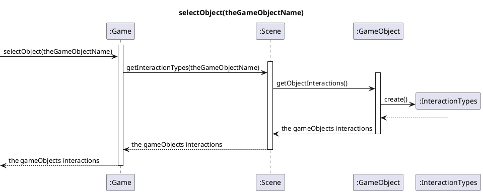

```plantuml
@startuml selectObject-1
title "selectObject(theGameObjectName)"
create participant ":Game" as gm
activate gm
[-> gm : selectObject(theGameObjectName)
activate ":Scene"
gm -> ":Scene" : getInteractionTypes(theGameObjectName)
activate ":GameObject"
":Scene" -> ":GameObject" : getObjectInteractions()
create participant ":InteractionTypes" as it
":GameObject" -> it : create()
it --> ":GameObject"
":Scene" <-- ":GameObject" : the gameObjects interactions
deactivate ":GameObject"
":Scene" --> gm : the gameObjects interactions
deactivate ":Scene"
[<-- gm : the gameObjects interactions
deactivate gm

@enduml
```
