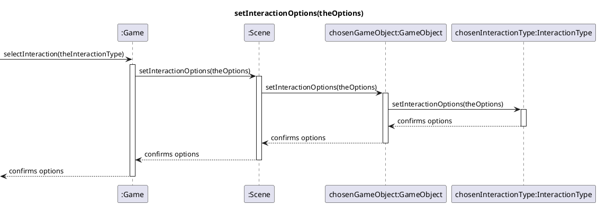

```plantuml
@startuml selectInteraction-1
title setInteractionOptions(theOptions)
create participant ":Game" as gm
[-> gm : selectInteraction(theInteractionType)
activate gm
gm -> ":Scene" : setInteractionOptions(theOptions)
activate ":Scene"
":Scene" -> "chosenGameObject:GameObject" : setInteractionOptions(theOptions)
activate "chosenGameObject:GameObject"
"chosenGameObject:GameObject" -> "chosenInteractionType:InteractionType" : setInteractionOptions(theOptions)
activate "chosenInteractionType:InteractionType"
"chosenGameObject:GameObject" <-- "chosenInteractionType:InteractionType" : confirms options
deactivate "chosenInteractionType:InteractionType"
":Scene" <-- "chosenGameObject:GameObject" : confirms options
deactivate "chosenGameObject:GameObject"
":Scene" --> gm : confirms options
deactivate ":Scene"
[<-- gm : confirms options
deactivate gm
@enduml
```