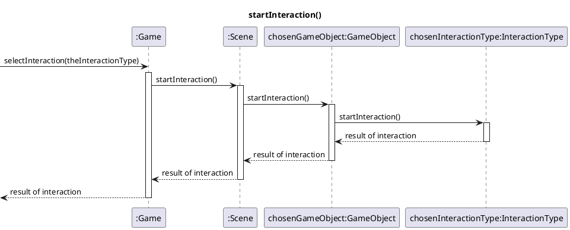

```plantuml
@startuml selectInteraction-1
title startInteraction()
create participant ":Game" as gm
[-> gm : selectInteraction(theInteractionType)
activate gm
gm -> ":Scene" : startInteraction()
activate ":Scene"
":Scene" -> "chosenGameObject:GameObject" : startInteraction()
activate "chosenGameObject:GameObject"
"chosenGameObject:GameObject" -> "chosenInteractionType:InteractionType" : startInteraction()
activate "chosenInteractionType:InteractionType"
"chosenGameObject:GameObject" <-- "chosenInteractionType:InteractionType" : result of interaction
deactivate "chosenInteractionType:InteractionType"
":Scene" <-- "chosenGameObject:GameObject" : result of interaction
deactivate "chosenGameObject:GameObject"
":Scene" --> gm : result of interaction
deactivate ":Scene"
[<-- gm : result of interaction
deactivate gm
@enduml
```