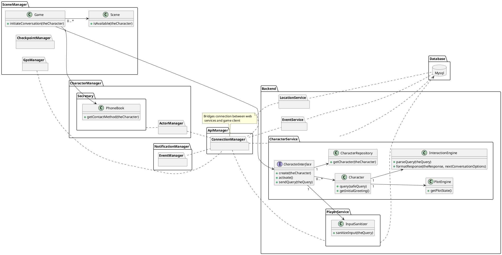

```plantuml
@startuml package-1
allowmixing
left to right direction
package "SceneManager" {
    package "CheckpointManager"{}
    package "GpsManager"{
    }
    class Game {
        + initiateConversation(theCharacter)
    }
    class Scene {
        + isAvailable(theCharacter)
    }
}

package "CharacterManager" {
    package "Secretary"{
        class PhoneBook {
            + getContactMethod(theCharacter)
        }
    }
    package "ActorManager"{}
}

package "Backend" {
package "LocationService"{}
package "PlayerService"{
    class InputSanitizer {
        + sanitizeInput(theQuery)
    }
}
package "CharacterService"{
    class CharacterRepository {
        + getCharacter(theCharacter)
    }
    class Character {
        + query(safeQuery)
        + getInitialGreeting()
    }
    interface CharacterInterface {
        + create(theCharacter)
        + activate()
        + sendQuery(theQuery)
    }
    class InteractionEngine {
        + parseQuery(theQuery)
        + formatResponse(theResponse, nextConversationOptions)
    }
    class PlotEngine {
        + getPlotState()
    }
}
package "EventService"{}
}
package "Database" {
    database "Mysql"
}
package "NotificationManager" {
    package "EventManager"{
    }
}
package "ApiManager" {
    package "ConnectionManager"{}
}
 LocationService .. Mysql
PlayerService ..> Mysql
CharacterService .. Mysql
EventService .. Mysql

ConnectionManager .. PlayerService
ConnectionManager .. LocationService
ConnectionManager .. CharacterService
ConnectionManager .. EventService

GpsManager .. ConnectionManager
EventManager .. ConnectionManager
Secretary .. ActorManager
ActorManager .. ConnectionManager


Game --> CharacterInterface
Game "1"--> PhoneBook
Game "0 .. *" --> Scene
CharacterInterface "1"--> CharacterRepository
CharacterInterface "0 .. *"--> Character

CharacterInterface "1" --> InputSanitizer
Character "1"--> InteractionEngine
Character "1"--> PlotEngine


note bottom of ConnectionManager: Bridges connection between web  \n services and game client

@enduml
```
