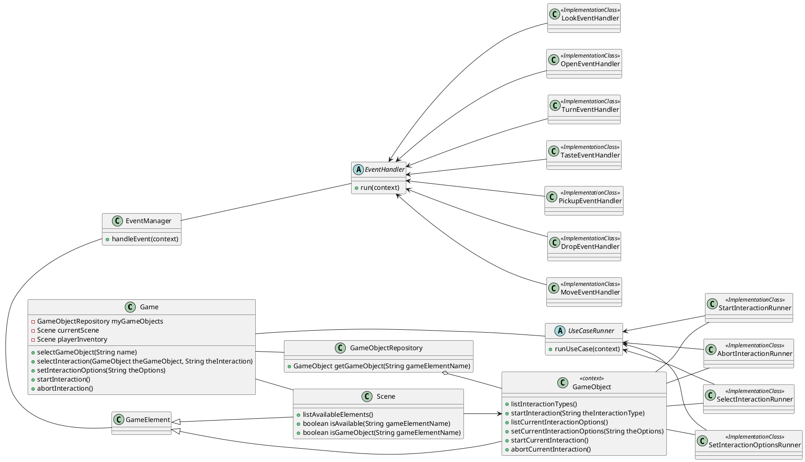

```plantuml
@startuml classDiagram-1
left to right direction
Game : +selectGameObject(String name)

Game : -GameObjectRepository myGameObjects
Game : -Scene currentScene
Game : -Scene playerInventory

Game -- Scene

Scene : +listAvailableElements()
Scene : +boolean isAvailable(String gameElementName)
Scene : +boolean isGameObject(String gameElementName)

GameElement <|-- Scene
Scene --> GameObject

class GameObjectRepository
class GameObject <<context>>
Game -- GameObjectRepository
GameObjectRepository : +GameObject getGameObject(String gameElementName)
GameObjectRepository o-- GameObject

GameElement <|-- GameObject

Game : +selectInteraction(GameObject theGameObject, String theInteraction)
Game : +setInteractionOptions(String theOptions)
Game : +startInteraction()
Game : +abortInteraction()
GameObject : +listInteractionTypes()
GameObject : +startInteraction(String theInteractionType)
GameObject : +listCurrentInteractionOptions()
GameObject : +setCurrentInteractionOptions(String theOptions)
GameObject : +startCurrentInteraction()
GameObject : +abortCurrentInteraction()

EventManager - GameElement
EventManager : +handleEvent(context)

EventManager -- EventHandler

abstract class  EventHandler{
+ run(context)
}
class MoveEventHandler <<ImplementationClass>>
class LookEventHandler <<ImplementationClass>>
class OpenEventHandler <<ImplementationClass>>
class TurnEventHandler <<ImplementationClass>>
class TasteEventHandler <<ImplementationClass>>
class PickupEventHandler <<ImplementationClass>>
class DropEventHandler <<ImplementationClass>>


EventHandler <-- MoveEventHandler 
EventHandler <-- LookEventHandler
EventHandler <-- OpenEventHandler
EventHandler <-- TurnEventHandler
EventHandler <-- TasteEventHandler
EventHandler <-- PickupEventHandler
EventHandler <-- DropEventHandler


abstract class UseCaseRunner {
+ runUseCase(context)
}

class SelectInteractionRunner <<ImplementationClass>>
class SetInteractionOptionsRunner <<ImplementationClass>>
class StartInteractionRunner <<ImplementationClass>>
class AbortInteractionRunner <<ImplementationClass>>

UseCaseRunner <-- SelectInteractionRunner
UseCaseRunner <-- SetInteractionOptionsRunner
UseCaseRunner <-- StartInteractionRunner
UseCaseRunner <-- AbortInteractionRunner

GameObject -- SelectInteractionRunner
GameObject -- SetInteractionOptionsRunner
GameObject -- StartInteractionRunner
GameObject -- AbortInteractionRunner
Game -- UseCaseRunner

@enduml
```