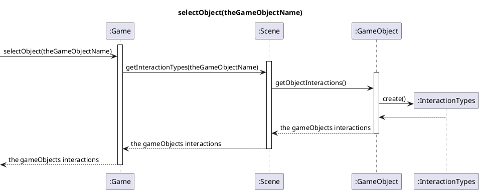
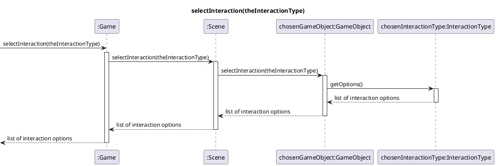
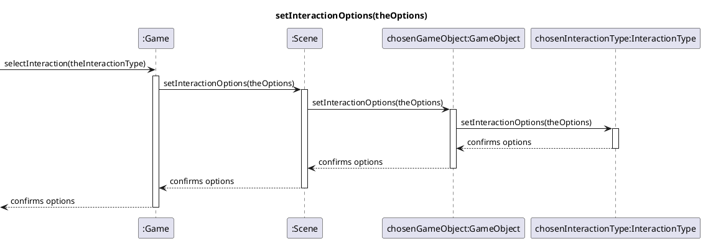
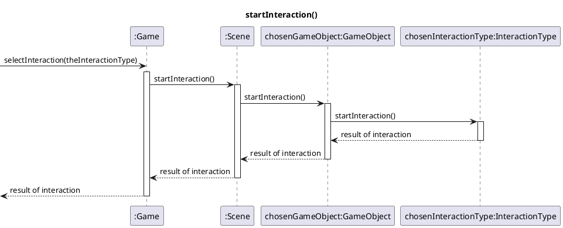

## Reflection 
Since we have chosen event based diagram everything goes through GAME it works as a controller over the system. The diagram is high cohesion because everything in the diagram have their responsibility and don't interact with others responsibilities. There are relatively high coupling but this makes the code easy to read and understand.

## Author
Linus Jansson, Max Dahlgren, Ben Björkman, Erik Glimberg