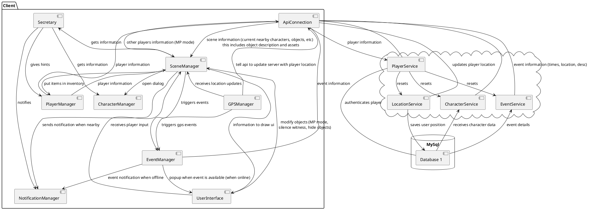

```plantuml
@startuml componentDiagram-1
database "MySql" {
    [Database 1] as db
}

cloud {
  [LocationService] as lo
  [PlayerService] as auth
  [CharacterService] as ch
  [EventService] as evs
  auth -- db : authenticates player
  lo --> db : saves user position
  ch <-- db : receives character data
  evs <-- db : event details
  auth --> lo : resets
  auth --> ch : resets
  auth --> evs : resets
}
package "Client" {
  [ApiConnection] as api
  [UserInterface] as ui
  [SceneManager] as scm
  [CharacterManager] as chm
  [GPSManager] as gps
  [NotificationManager] as noti
  [EventManager] as ev
  [PlayerManager] as pl
  [Secretary] as sec
  sec --> pl : gives hints
  ui --> scm : modify objects (MP mode,\n silence witness, hide objects)
  sec <-- scm : gets information  
sec --> noti : notifies
sec --> chm : gets information
api --> scm : other players information (MP mode)
  pl --> scm : player information
  api --> auth : player information
  scm --> pl : put items in inventory
 pl --> api : player information
  gps --> ev : triggers gps events
  scm --> ev : triggers events
  ev -- api : event information
  api -- evs : event information (times, location, desc)
  ev --> noti : event notification when offline
  ev --> ui : popup when event is available (when online)
  scm --> chm : open dialog
  ui --> scm : receives player input
  scm <-- api : scene information (current nearby characters, objects, etc) \n this includes object description and assets
  scm --> ui : information to draw ui
  scm --> noti : sends notification when nearby
  scm <-- gps : receives location updates
  gps --> api : tell api to update server with player location
  api -- lo : updates player location 
  api -- auth
  api -- ch
}


@enduml
```